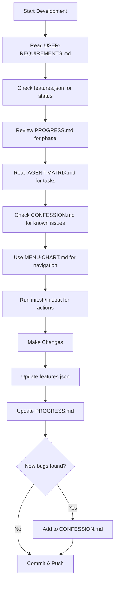

<!-- BREADCRUMB: 0.development-matrix/ -->
<!-- 
📂 DEVELOPMENT MATRIX STRUCTURE:
├── INDEX.md .................. [YOU ARE HERE] Start here
├── 0.development.md .......... Development rules & contract
├── USER-REQUIREMENTS.md ...... What user wants (READ-ONLY)
├── features.json ............. Feature status (machine-readable)
├── PROGRESS.md ............... Phase completion tracking
├── relationships.md .......... File/DB/API dependencies
├── skills.md ................. Testing protocols & learnings
├── ENGINEERING-GUARDRAILS.md . Anti-patterns to avoid
├── CONFESSION.md ............. Known bugs & gaps
├── MENU-CHART.md ............. Menu system documentation
└── ARCHITECTURE.md ........... System architecture
-->

# 📚 INDEX.md - Blogger-MCP Documentation Hub

> **Central index of all documentation files in the Autonomous Blogging System**
> **Last Updated:** 2025-12-16

---

## 🚨 MANDATORY DEVELOPMENT DOCUMENTS

> **⚠️ CRITICAL: ALL development work MUST check these documents FIRST before making any changes!**

These 7 documents form the **Development Process Checklist**. Every Claude Code agent, developer, or contributor MUST review these before starting any work:

```
┌─────────────────────────────────────────────────────────────────────────────┐
│                    📋 DEVELOPMENT PROCESS CHECKLIST                         │
├─────────────────────────────────────────────────────────────────────────────┤
│  1. 📖 USER-REQUIREMENTS.md    │ What the user actually wants (READ-ONLY)   │
│  2. 📊 features.json           │ Current feature status & test results      │
│  3. 📈 PROGRESS.md             │ Phase completion status                    │
│  4. 🔗 relationships.md        │ System dependency map (CONSULT FIRST)      │
│  5. 🧠 skills.md               │ Learnings & error patterns (LEARN FROM)    │
│  6. 🚧 ENGINEERING-GUARDRAILS  │ Anti-patterns & violations (MUST AVOID)    │
│  7. 🤖 AGENT-MATRIX.md         │ Task definitions & execution prompts       │
│  8. 🙏 CONFESSION.md           │ Known bugs & honest issues                 │
│  9. 📊 MENU-CHART.md           │ Menu system & workflow options             │
│ 10. 🛠️ init.sh / init.bat      │ Interactive development menu               │
└─────────────────────────────────────────────────────────────────────────────┘
```

### Development Workflow



### Before ANY Code Change:
1. ✅ Read `USER-REQUIREMENTS.md` - Understand what user wants
2. ✅ Check `features.json` - See current test pass/fail status
3. ✅ Review `PROGRESS.md` - Know which phase you're in
4. ✅ **Consult `relationships.md`** - Understand file/service dependencies
5. ✅ **Review `skills.md`** - Learn from past errors, follow testing protocol
6. ✅ **Check `ENGINEERING-GUARDRAILS.md`** - Avoid known anti-patterns
7. ✅ Read `AGENT-MATRIX.md` - Get your task definition
8. ✅ Check `CONFESSION.md` - Avoid known issues

### After ANY Code Change:
1. ✅ Update `features.json` - Set testPass: true/false
2. ✅ Update `PROGRESS.md` - Mark task complete
3. ✅ Add to `CONFESSION.md` - If you found new issues
4. ✅ **Update `relationships.md`** - If you added new dependencies
5. ✅ **Update `skills.md`** - If you learned something reusable
6. ✅ **Update `ENGINEERING-GUARDRAILS.md`** - If you discovered a new anti-pattern

---

## 🗂️ Quick Navigation

| Document | Purpose | Priority | Status |
|----------|---------|----------|--------|
| [USER-REQUIREMENTS.md](#user-requirementsmd) | User requirements (READ-ONLY) | 🔴 CRITICAL | 📖 Reference |
| [features.json](#featuresjson) | Feature tracking with test status | 🔴 CRITICAL | ✅ Machine-readable |
| [PROGRESS.md](#progressmd) | Project completion status | 🔴 CRITICAL | ✅ Updated |
| [relationships.md](#relationshipsmd) | System dependency map | 🔴 CRITICAL | ✅ NEW |
| [skills.md](#skillsmd) | Learnings & error patterns | 🔴 CRITICAL | ✅ NEW |
| [ENGINEERING-GUARDRAILS.md](#engineering-guardrailsmd) | Anti-patterns to avoid | 🔴 CRITICAL | ✅ NEW |
| [AGENT-MATRIX.md](#agent-matrixmd) | Claude Code agent tasks | 🔴 CRITICAL | ✅ v3.1.0 |
| [CONFESSION.md](#confessionmd) | Known issues & missed items | 🟡 IMPORTANT | ⚠️ Honest |
| [MENU-CHART.md](#menu-chartmd) | Visual menu system | 🟡 IMPORTANT | ✅ New |
| [GEMINI-TEST-PLAN.md](#gemini-test-planmd) | AI User Journey Test Plan | 🟢 REFERENCE | ✅ New |
| [init.sh / init.bat](#initsh--initbat) | Interactive menu scripts | 🟡 IMPORTANT | ✅ Runnable |
| [README.md](#readmemd) | Main project overview | 🟢 INFO | ✅ Current |

---

## 📄 Core Development Documents

### README.md
**Location:** `/README.md`  
**Purpose:** Main project documentation with quick start guide

**Key Contents:**
- Quick start commands
- Project structure (135+ MCP tools)
- Module listing (30 core modules)
- Tool categories
- Installation instructions

```bash
# Quick Start
git clone https://github.com/prakashgarg91/Blogger-MCP.git
cd Blogger-MCP
npm install
start-all.bat  # Windows one-click start
```

---

### AGENT-MATRIX.md
**Location:** `/AGENT-MATRIX.md`  
**Purpose:** Task matrix for Claude Code autonomous agents

**Key Sections:**
- Phase 0: Critical Fixes ✅ COMPLETE
- Phase 1-9: Feature implementation phases
- Agent configuration (project-manager, executor-alpha, executor-beta)
- Checkpoint prompts for each phase
- Execution commands

**Current Version:** 3.1.0  
**Last Updated:** December 6, 2025

---

### USER-REQUIREMENTS.md
**Location:** `/USER-REQUIREMENTS.md`  
**Purpose:** Original user requirements - DO NOT EDIT

⚠️ **This file contains the human requirements and should not be modified by agents.**

**Key Requirements:**
1. 100% Autonomous Blogging System
2. Google OAuth login
3. Source monitoring (ICAI, IGNOU, Income Tax, etc.)
4. AI content generation
5. Auto-publishing to Blogger
6. SEO optimization
7. Search Console integration
8. Knowledge base with Qdrant

---

### PROGRESS.md
**Location:** `/PROGRESS.md`  
**Purpose:** Current project completion status

**Progress Overview:**
```
Phase 0: Critical Fixes     ████████████████████ 100% ✅
Phase 1: Verification       ████████████░░░░░░░░  60% 🔄
Phase 2: Dashboard          ████████░░░░░░░░░░░░  40% 🔄
Phase 3: Authentication     ████████████████████ 100% ✅
Phase 4: AI Content         ████████░░░░░░░░░░░░  40% ⏳
Phase 5: Auto-Publishing    ████░░░░░░░░░░░░░░░░  20% ⏳
Phase 6: SEO Engine         ████████░░░░░░░░░░░░  40% ⏳
Phase 7: Analytics/KB       ████░░░░░░░░░░░░░░░░  20% ⏳
OVERALL                     ████████████░░░░░░░░  45%
```

---

### features.json
**Location:** `/features.json`  
**Purpose:** Machine-readable feature tracking with test pass/fail status

**Structure:**
```json
{
  "infrastructure": { "qdrant": { "testPass": true }, ... },
  "features": {
    "authentication": { "googleOAuth": { "testPass": true } },
    "contentGeneration": { ... },
    "publishing": { ... },
    "seo": { ... },
    "knowledgeBase": { ... }
  }
}
```

**Test Summary:**
- Total Features: 50+
- Passed: 25
- Failed: 10
- Skipped: 15

---

### MENU-CHART.md
**Location:** `/MENU-CHART.md`  
**Purpose:** Visual menu system for init.sh/init.bat

**Key Features:**
- Main menu with 15 options
- Phase execution sub-menu
- Feature test sub-menu
- Progress dashboard view

See [MENU-CHART.md](MENU-CHART.md) for full menu structure.

---

### init.sh / init.bat
**Location:** `/init.sh` (Linux/Mac) and `/init.bat` (Windows)  
**Purpose:** Interactive development menu scripts

**Usage:**
```bash
# Linux/Mac
./init.sh

# Windows
init.bat
```

**Menu Options:**
1. Start All Services
2. Stop All Services
3. View Service Status
4. Run Feature Tests
5. Execute Phase (Claude Code integration)
6. Generate Claude Prompt
7. Check features.json
8. Open Dashboard
9. Git Status & Commit
10. And more...

**Integration:** These scripts read from `AGENT-MATRIX.md` and `features.json` to provide context-aware options.

---

### CONFESSION.md
**Location:** `/CONFESSION.md`  
**Purpose:** Honest acknowledgment of errors, misses, and issues

**⚠️ Important:** This file should be updated whenever:
- A bug is discovered
- A feature doesn't work as expected
- A requirement was missed
- Technical debt is identified

Contains:
- Known bugs
- Features marked working but not tested
- Missed requirements
- Technical debt
- Correction log

---

## 🔧 Server Documentation

### server/README.md
**Location:** `/server/README.md`  
**Purpose:** Backend server documentation

**Key Info:**
- Express.js + TypeScript
- Port 3001
- SQLite database (37 tables)
- 46+ API endpoints

---

## 📁 Project Structure (Clean)

```
Blogger-MCP/
├── server/                 # Express.js backend API
│   ├── src/               # TypeScript source
│   │   ├── routes/        # 18 API route files
│   │   ├── services/      # 16 business services
│   │   ├── db/            # SQLite database module
│   │   └── middleware/    # Auth & error handling
│   └── data/              # SQLite database files
├── dashboard/             # React + Vite frontend
│   └── src/
│       ├── pages/         # 15 page components
│       ├── components/    # Reusable UI components
│       ├── hooks/         # React Query hooks
│       └── services/      # API client
├── blogger-mcp/           # MCP server & tools
│   ├── index.js           # Main MCP entry
│   ├── templates/         # Blog post templates
│   ├── config/            # Configuration files
│   └── utils/             # Utility modules
├── tools/                 # Development utilities
│   ├── feature-tests.mjs  # API endpoint tests
│   └── update-features.mjs # Feature JSON updater
├── features.json          # Source of truth (v4.1.0)
├── START.bat              # One-click launcher
├── init.sh                # Interactive menu
└── docker-compose.yml     # Qdrant + Redis
```

### Key Files (7 Essential Documents)
| File | Purpose |
|------|---------|
| `features.json` | Source of truth - test status |
| `PROGRESS.md` | Phase completion tracking |
| `AGENT-MATRIX.md` | Agent task definitions |
| `CONFESSION.md` | Known issues (honest) |
| `ARCHITECTURE.md` | System design |
| `MENU-CHART.md` | Menu system reference |
| `GEMINI-TEST-PLAN.md` | AI User Journey Test Plan |
| `USER-REQUIREMENTS.md` | Original requirements |

---

## 🛠️ Scripts

| File | Purpose |
|------|---------|
| `START.bat` | One-click start (Server + Dashboard) |
| `init.sh` | Interactive development menu |
| `docker-compose.yml` | Qdrant & Redis containers |

---

## 🔗 External Resources

- **GitHub Repository:** https://github.com/prakashgarg91/Blogger-MCP
- **Node.js:** ≥18.0.0
- **Docker:** Required for Qdrant

---

## 📊 Documentation Standards

### Naming Conventions
- `UPPERCASE.md` - Important project documents
- `*.json` - Configuration/data files
- `*.bat/*.sh` - Scripts

### Update Frequency
| Type | Frequency |
|------|-----------|
| `features.json` | After each test run |
| `PROGRESS.md` | After each phase |
| `CONFESSION.md` | When issues discovered |

---

*Updated: 2025-12-14 | Cleaned codebase structure*
