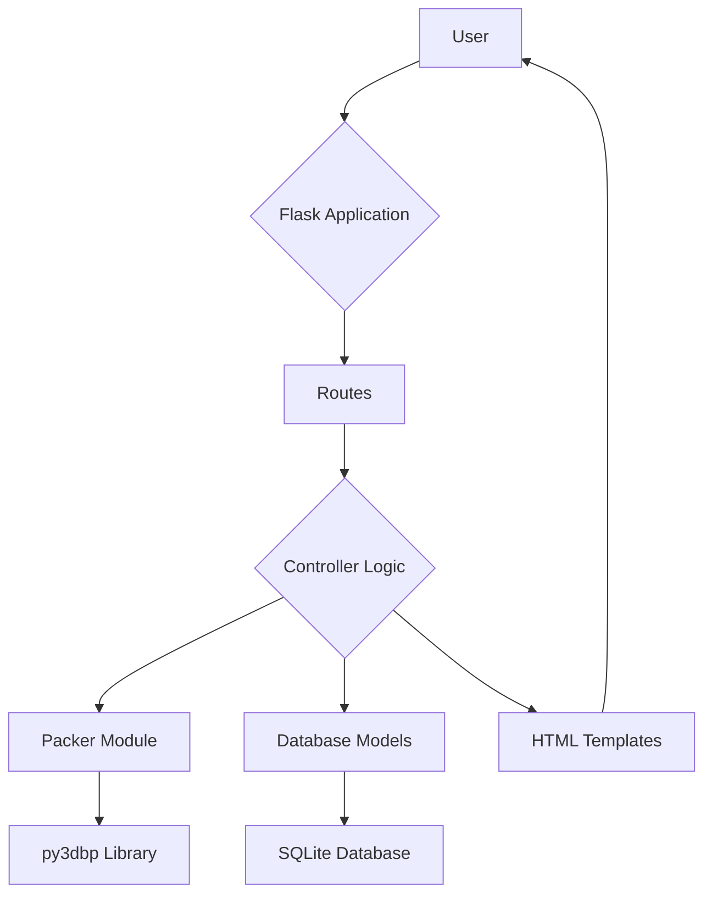

# TruckOpti: 3D Loading Optimizer

TruckOpti is a web-based application designed to optimize truck loading by efficiently packing cartons into trucks using a 3D packing algorithm. It helps businesses minimize shipping costs by maximizing space utilization and reducing the number of trucks required for shipments.

## Key Features

### Core Packing & Optimization Functions
- **3D Packing Algorithm:** Advanced 3D bin packing using `py3dbp` library with support for multiple optimization goals (space, cost, weight, minimum trucks)
- **Multi-Truck Fleet Optimization:** Efficiently distributes cartons across multiple trucks of different types and quantities
- **Truck Requirement Calculator:** Determines the minimum number and type of trucks needed for a given set of cartons
- **Truck Recommendation Engine:** Recommends optimal truck types based on carton requirements and cost optimization
- **Carton Fitting Analysis:** Tests how specific carton combinations fit into available truck configurations

### Management & Configuration
- **Truck Type Management:** Add, edit, delete, and configure truck types with dimensions, weight limits, costs, and operational parameters
- **Carton Type Management:** Manage carton types with properties like dimensions, weight, rotation capability, fragility, stackability, priority, and value
- **Packing Job Lifecycle:** Create, track, and manage packing jobs with different optimization strategies
- **Fleet Configuration:** Configure available truck fleets with quantities and operational costs

### Advanced Features
- **Batch Processing:** Upload CSV files to process multiple packing requirements simultaneously
- **Multi-Optimization Goals:** Support for space utilization, cost minimization, weight distribution, and truck count minimization
- **Cost Analysis:** Comprehensive cost calculations including fuel, maintenance, driver costs, and cargo value
- **Export Functionality:** Export packing results to CSV format with detailed positioning data
- **Analytics Dashboard:** Real-time metrics including space utilization, costs, shipment statistics, and fleet analysis

### Data Management & APIs
- **RESTful API:** Complete REST API for truck types, carton types, and packing operations
- **Database Management:** SQLite database with models for trucks, cartons, customers, routes, shipments, and analytics
- **3D Visualization:** Interactive 3D visualization of packed cartons with positioning and rotation data
- **Result Tracking:** Persistent storage of packing results with utilization metrics and cost analysis

## Application Functions

### Web Interface Pages
1. **Dashboard (/)** - Overview with statistics, charts, and key metrics
2. **Truck Types Management (/truck-types)** - View, add, edit, and delete truck configurations
3. **Carton Types Management (/carton-types)** - Manage carton specifications and properties
4. **Packing Jobs (/packing-jobs)** - Create and track packing operations
5. **Truck Recommendation (/recommend-truck)** - Get optimal truck suggestions for specific carton loads
6. **Carton Fitting Tool (/fit-cartons)** - Test carton compatibility with available trucks
7. **Fleet Optimization (/fleet-optimization)** - Optimize entire fleet utilization
8. **Truck Requirements Calculator (/calculate-truck-requirements)** - Determine minimum truck needs
9. **Batch Processing (/batch-processing)** - Upload CSV files for bulk operations
10. **Analytics Dashboard (/analytics)** - Advanced metrics and performance analysis
11. **Packing Results (/packing-job/<id>)** - Detailed 3D visualization and results

### API Endpoints
- **GET/POST /api/truck-types** - Truck type CRUD operations
- **GET/POST /api/carton-types** - Carton type CRUD operations  
- **GET /api/packing_jobs** - Retrieve packing job data
- **POST /api/calculate-truck-requirements** - API for truck requirement calculation
- **POST /api/fleet-optimization** - API for fleet optimization
- **GET /api/analytics** - Retrieve analytics data

### Core Business Functions
- **Load Optimization:** Maximize space and weight utilization across truck fleets
- **Cost Minimization:** Reduce transportation costs through optimal truck selection and loading
- **Route Planning Support:** Integration with customer and route management
- **Shipment Tracking:** End-to-end shipment lifecycle management
- **Performance Analytics:** Track KPIs like utilization rates, costs, and efficiency metrics
- **Data Export:** Generate reports and export results in CSV format

## User Interface Buttons

### Navigation Buttons (Available on all pages)
- **Dashboard** - Navigate to main dashboard with statistics and charts
- **Packing Jobs** - Access packing job management and creation
- **Truck Types** - Manage truck type configurations
- **Carton Types** - Manage carton type specifications
- **Recommend Truck for Cartons** - Access truck recommendation engine
- **Fit Cartons in Selected Trucks** - Test carton fitting capabilities
- **Truck Requirement Calculator** - Calculate minimum truck requirements
- **Fleet Optimization** - Optimize entire fleet utilization
- **Analytics** - View advanced metrics and performance data
- **Batch Processing** - Process multiple jobs via CSV upload
- **Customers** - Customer management (placeholder)
- **Routes** - Route management (placeholder)
- **Settings** - Application settings (placeholder)

### Action Buttons by Page

#### Truck Types Management
- **Add Truck** (`btn-primary`) - Create new truck type
- **Edit** (`btn-warning`) - Modify existing truck specifications  
- **Delete** (`btn-danger`) - Remove truck type (with confirmation dialog)

#### Carton Types Management  
- **Add New Carton Type** (`btn-primary`) - Create new carton specification
- **Edit** (`btn-info`) - Modify existing carton properties
- **Delete** (`btn-danger`) - Remove carton type (with confirmation dialog)

#### Packing Jobs
- **Create New Packing Job** (`btn-primary`) - Start new packing operation
- **View Details** (`btn-primary`) - View 3D packing results and metrics
- **Delete** (`btn-danger`) - Remove packing job (with confirmation dialog)

#### Form Management Buttons
- **Add Carton** (`btn-outline-secondary`) - Add new carton row to forms
- **Remove** (`btn-danger`) - Remove carton row from forms
- **Add Another Carton Type** (`btn-secondary`) - Add carton row in packing jobs

#### Submit Buttons
- **Add Truck Type** (`btn-primary`) - Submit truck type creation form
- **Add Carton Type** (`btn-primary`) - Submit carton type creation form  
- **Create Job** (`btn-primary`) - Submit packing job creation form
- **Process Batch** (`btn-primary`) - Submit CSV file for batch processing
- **Calculate** (`btn-primary`) - Submit truck requirement calculation
- **Fit Cartons** (`btn-success`) - Submit carton fitting analysis
- **Optimize Fleet** (`btn-success`) - Submit fleet optimization request
- **Recommend Truck** (`btn-success`) - Submit truck recommendation request

#### Utility Buttons
- **Export to CSV** (`btn-secondary`) - Export packing results to CSV file
- **Close Alert** (`btn-close`) - Dismiss notification messages
- **Wizard Next/Previous** - Navigate through multi-step forms

### Button Features
- **Confirmation Dialogs:** All delete operations require user confirmation
- **Dynamic Management:** Add/Remove buttons automatically manage form rows
- **Responsive Design:** Buttons adapt to different screen sizes
- **Icon Integration:** Many buttons include Bootstrap icons for better UX
- **Consistent Styling:** Uses Bootstrap color classes (primary, danger, success, etc.)

## Technology Stack

- **Backend:** Flask, Python
- **Frontend:** HTML, CSS, JavaScript, Three.js (for 3D visualization)
- **Database:** SQLite (with Flask-SQLAlchemy)
- **Testing:** Puppeteer, Jest

## Project Setup

### Prerequisites

- Python 3.x
- Node.js and npm

### Installation

1. **Clone the repository:**
   ```bash
   git clone https://github.com/your-username/TruckOpti.git
   cd TruckOpti
   ```

2. **Install Python dependencies:**
   ```bash
   pip install -r requirements.txt
   ```

3. **Install Node.js dependencies:**
   ```bash
   npm install
   ```

4. **Initialize the database:**
   - The database is automatically created when the application starts.

5. **Run the application:**
   ```bash
   python run.py
   ```
   The application will be accessible at `http://127.0.0.1:5000`.

## Application Architecture

The application follows a standard Flask project structure:

- **`run.py`**: The entry point of the application. It creates the Flask app and runs the development server.
- **`app/`**: The main application package.
  - **`__init__.py`**: Initializes the Flask application and its extensions (e.g., SQLAlchemy).
  - **`models.py`**: Defines the database models using Flask-SQLAlchemy.
  - **`routes.py`**: Contains the application's routes and view functions.
  - **`packer.py`**: Implements the 3D packing logic using the `py3dbp` library.
  - **`static/`**: Contains static assets such as CSS, JavaScript, and images.
  - **`templates/`**: Contains the HTML templates for the application.

### Architecture Diagram



## Testing

The application uses Puppeteer for end-to-end testing.

### Running the Tests

1. **Make sure the application is running:**
   ```bash
   python run.py
   ```

2. **In a separate terminal, run the tests:**
   ```bash
   npm test
   ```