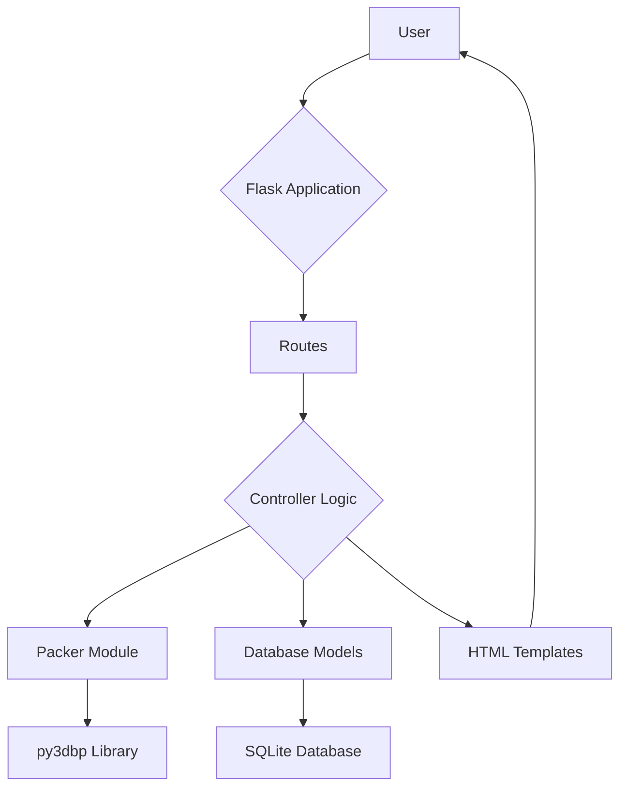

# TruckOpti: 3D Loading Optimizer

TruckOpti is a web-based application designed to optimize truck loading by efficiently packing cartons into trucks using a 3D packing algorithm. It helps businesses minimize shipping costs by maximizing space utilization and reducing the number of trucks required for shipments.

## Key Features

- **3D Visualization:** Interactive 3D visualization of packed cartons in a truck.
- **Efficient Packing Algorithm:** Utilizes the `py3dbp` library to find the optimal packing solution.
- **Truck and Carton Management:** Easily add, edit, and delete truck and carton types.
- **Packing Job Management:** Create and manage packing jobs with specific truck and carton configurations.
- **RESTful API:** Provides a RESTful API for managing truck types, carton types, and packing jobs.
- **Analytics Dashboard:** Displays key metrics such as space utilization, total costs, and shipment statistics.

## Technology Stack

- **Backend:** Flask, Python
- **Frontend:** HTML, CSS, JavaScript, Three.js (for 3D visualization)
- **Database:** SQLite (with Flask-SQLAlchemy)
- **Testing:** Puppeteer, Jest

## Project Setup

### Prerequisites

- Python 3.x
- Node.js and npm

### Installation

1. **Clone the repository:**
   ```bash
   git clone https://github.com/your-username/TruckOpti.git
   cd TruckOpti
   ```

2. **Install Python dependencies:**
   ```bash
   pip install -r requirements.txt
   ```

3. **Install Node.js dependencies:**
   ```bash
   npm install
   ```

4. **Initialize the database:**
   - The database is automatically created when the application starts.

5. **Run the application:**
   ```bash
   python run.py
   ```
   The application will be accessible at `http://127.0.0.1:5000`.

## Application Architecture

The application follows a standard Flask project structure:

- **`run.py`**: The entry point of the application. It creates the Flask app and runs the development server.
- **`app/`**: The main application package.
  - **`__init__.py`**: Initializes the Flask application and its extensions (e.g., SQLAlchemy).
  - **`models.py`**: Defines the database models using Flask-SQLAlchemy.
  - **`routes.py`**: Contains the application's routes and view functions.
  - **`packer.py`**: Implements the 3D packing logic using the `py3dbp` library.
  - **`static/`**: Contains static assets such as CSS, JavaScript, and images.
  - **`templates/`**: Contains the HTML templates for the application.

### Architecture Diagram



## Testing

The application uses Puppeteer for end-to-end testing.

### Running the Tests

1. **Make sure the application is running:**
   ```bash
   python run.py
   ```

2. **In a separate terminal, run the tests:**
   ```bash
   npm test
   ```