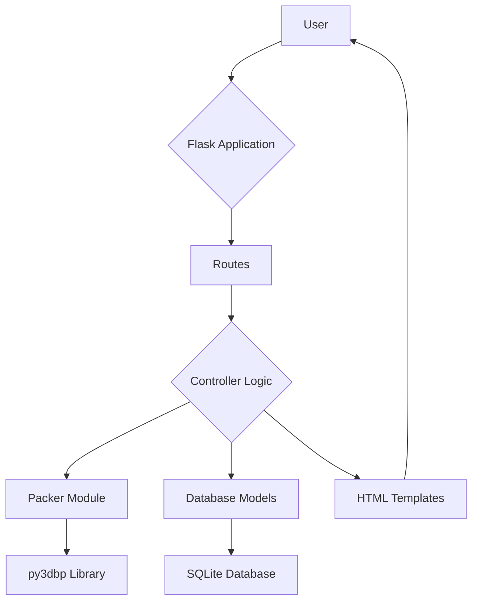

# 🚛 TruckOpti: 3D Truck Loading Optimization Platform

[](https://python.org)
[](https://flask.palletsprojects.com)
[](LICENSE)
[]()

**TruckOpti** is a comprehensive 3D truck loading optimization platform that uses advanced bin packing algorithms to maximize space utilization, reduce transportation costs, and optimize fleet operations. Built with Flask, Python, and modern web technologies, it provides an intuitive interface for logistics professionals.

---

## 📋 Table of Contents

- [🚀 Quick Start](#-quick-start)
- [✨ Key Features](#-key-features)
- [🏗️ Architecture](#️-architecture)
- [📁 Project Structure](#-project-structure)
- [⚙️ Installation](#️-installation)
- [🎯 Usage Guide](#-usage-guide)
- [🔧 API Reference](#-api-reference)
- [🧪 Testing](#-testing)
- [📊 Development](#-development)
- [🤝 Contributing](#-contributing)
- [📄 License](#-license)

---

## 🚀 Quick Start

```bash
# Clone the repository
git clone https://github.com/your-username/TruckOpti.git
cd TruckOpti

# Install dependencies
pip install -r requirements.txt
npm install

# Run the application
python run.py
```

🌐 **Access the application at:** `http://127.0.0.1:5000`

---

## ✨ Key Features

### 🎯 Core Optimization Engine
- **3D Bin Packing Algorithm**: Advanced py3dbp integration with multiple optimization strategies
- **Smart Truck Recommendations**: Algorithm-based suggestions for optimal truck selection
- **Fleet Packing Optimization**: Pack cartons into your available fleet with remaining item recommendations
- **Multi-Objective Optimization**: Space, cost, weight, and truck count minimization

### 📊 Management & Analytics
- **Truck Type Management**: Complete CRUD operations with dimensional and cost specifications
- **Carton Type Management**: Detailed carton properties including fragility, priority, and stackability
- **Real-time Analytics Dashboard**: KPIs, utilization metrics, and performance tracking
- **Professional UI**: Bootstrap 5 + DataTables.js with export capabilities (CSV, Excel, PDF)

### 🚀 Advanced Features
- **Batch Processing**: CSV upload for bulk operations
- **3D Visualization**: Three.js integration for interactive packing results
- **Cost Analysis**: Comprehensive operational cost calculations (when data available)
- **RESTful API**: Complete API for integration with external systems
- **Responsive Design**: Mobile-friendly interface for field operations

---

## 🏗️ Architecture

```
┌─────────────────┐    ┌─────────────────┐    ┌─────────────────┐
│   Frontend      │    │    Backend      │    │   Database      │
│  (Bootstrap 5)  │◄──►│    (Flask)      │◄──►│   (SQLite)      │
│   Three.js      │    │   py3dbp        │    │  SQLAlchemy     │
│   DataTables    │    │   Algorithms    │    │   Models        │
└─────────────────┘    └─────────────────┘    └─────────────────┘
```

### Technology Stack
- **Backend**: Flask + Python 3.8+ + SQLAlchemy
- **Frontend**: Bootstrap 5 + Three.js + DataTables.js
- **Database**: SQLite with comprehensive data models
- **Testing**: Puppeteer + Jest + Python unittest
- **Build**: PyInstaller for standalone executables

---

## 📁 Project Structure

```
TruckOpti/
├── 📁 app/                          # Main application package
│   ├── 🐍 __init__.py               # Flask app initialization
│   ├── 🐍 models.py                 # Database models
│   ├── 🐍 routes.py                 # Web routes & API endpoints
│   ├── 🐍 packer.py                 # 3D packing algorithms
│   ├── 🐍 cost_engine.py            # Cost calculation engine
│   ├── 🐍 route_optimizer.py        # Route optimization (future)
│   ├── 📁 static/                   # Static assets
│   │   ├── 🎨 style.css             # Main stylesheet
│   │   ├── ⚡ main.js               # Core JavaScript
│   │   └── 📁 js/                   # Additional JS modules
│   ├── 📁 templates/                # Jinja2 HTML templates
│   │   ├── 🏠 base.html             # Base template
│   │   ├── 📊 index.html            # Dashboard
│   │   ├── 🚛 truck_types.html      # Truck management
│   │   ├── 📦 carton_types.html     # Carton management
│   │   ├── 💡 recommend_truck.html  # Smart recommendations
│   │   ├── 🔧 fleet_optimization.html # Fleet packing
│   │   └── 📈 analytics.html        # Analytics dashboard
│   └── 🗄️ truck_opti.db            # SQLite database
├── 📁 tests/                       # Test suite
├── 📁 docs/                        # Documentation (cleaned)
├── 🐍 run.py                       # Application entry point
├── 📋 requirements.txt             # Python dependencies
├── 📋 package.json                 # Node.js dependencies
└── 📋 README.md                    # This file
```

---

## ⚙️ Installation

### Prerequisites
- Python 3.8 or higher
- Node.js 14+ (optional, for development)
- Git

### Step-by-Step Setup

1. **Clone Repository**
   ```bash
   git clone https://github.com/your-username/TruckOpti.git
   cd TruckOpti
   ```

2. **Create Virtual Environment**
   ```bash
   python -m venv venv
   source venv/bin/activate  # On Windows: venv\Scripts\activate
   ```

3. **Install Dependencies**
   ```bash
   pip install -r requirements.txt
   ```

4. **Initialize Database**
   ```bash
   python -c "from app import create_app, db; app = create_app(); app.app_context().push(); db.create_all()"
   ```

5. **Run Application**
   ```bash
   python run.py
   ```
   🌐 Access at: `http://127.0.0.1:5000`

---

## 🎯 Usage Guide

### 🏠 Dashboard Overview
The main dashboard provides:
- **KPI Widgets**: Space utilization, cost savings, active jobs
- **Quick Actions**: Direct access to core features
- **Recent Activity**: Latest packing operations
- **Analytics Charts**: Performance trends and metrics

### 🚛 Managing Trucks
1. **Navigate**: Dashboard → Truck Types
2. **Add Truck**: Click "Add Truck Type"
3. **Configure**: Set dimensions, weight limits, costs
4. **Export Data**: Use DataTables export (CSV/Excel/PDF)

### 📦 Managing Cartons
1. **Navigate**: Dashboard → Carton Types
2. **Add Carton**: Click "Add New Carton Type"
3. **Properties**: Set dimensions, weight, fragility, priority
4. **Bulk Operations**: Use CSV import for multiple items

### 💡 Smart Truck Recommendations
1. **Navigate**: Dashboard → Smart Truck Recommendations
2. **Input Cartons**: Add carton types and quantities
3. **Get Recommendations**: Algorithm suggests optimal trucks
4. **Review Results**: Compare efficiency scores and utilization

### 🔧 Fleet Packing Optimization
1. **Navigate**: Dashboard → Fleet Packing Optimization
2. **Select Fleet**: Choose available trucks
3. **Add Cartons**: Specify items to pack
4. **Optimize**: Get packing plan + remaining item recommendations
5. **3D Visualization**: View interactive packing results

### 📊 Batch Processing
1. **Navigate**: Dashboard → Batch Processing
2. **Upload CSV**: Use provided template format
3. **Process**: Bulk optimization of multiple shipments
4. **Download Results**: Export all results to CSV

---

## 🔧 API Reference

### Core Endpoints

#### Truck Management
```http
GET    /api/truck-types          # List all truck types
POST   /api/truck-types          # Create new truck type
PUT    /api/truck-types/{id}     # Update truck type
DELETE /api/truck-types/{id}     # Delete truck type
```

#### Carton Management
```http
GET    /api/carton-types         # List all carton types
POST   /api/carton-types         # Create new carton type
PUT    /api/carton-types/{id}    # Update carton type
DELETE /api/carton-types/{id}    # Delete carton type
```

#### Optimization Services
```http
POST   /api/recommend-truck      # Get truck recommendations
POST   /api/fleet-optimization   # Optimize fleet packing
POST   /api/batch-process        # Process multiple jobs
GET    /api/analytics           # Retrieve analytics data
```

### Example API Usage

```python
import requests

# Get truck recommendations
response = requests.post('http://localhost:5000/api/recommend-truck', json={
    'cartons': [
        {'carton_type_id': 1, 'quantity': 10},
        {'carton_type_id': 2, 'quantity': 5}
    ],
    'optimization_goal': 'space'
})
recommendations = response.json()
```

## Technology Stack

- **Backend:** Flask, Python
- **Frontend:** HTML, CSS, JavaScript, Three.js (for 3D visualization)
- **Database:** SQLite (with Flask-SQLAlchemy)
- **Testing:** Puppeteer, Jest

## Project Setup

### Prerequisites

- Python 3.x
- Node.js and npm

### Installation

1. **Clone the repository:**
   ```bash
   git clone https://github.com/your-username/TruckOpti.git
   cd TruckOpti
   ```

2. **Install Python dependencies:**
   ```bash
   pip install -r requirements.txt
   ```

3. **Install Node.js dependencies:**
   ```bash
   npm install
   ```

4. **Initialize the database:**
   - The database is automatically created when the application starts.

5. **Run the application:**
   ```bash
   python run.py
   ```
   The application will be accessible at `http://127.0.0.1:5000`.

## Application Architecture

The application follows a standard Flask project structure:

- **`run.py`**: The entry point of the application. It creates the Flask app and runs the development server.
- **`app/`**: The main application package.
  - **`__init__.py`**: Initializes the Flask application and its extensions (e.g., SQLAlchemy).
  - **`models.py`**: Defines the database models using Flask-SQLAlchemy.
  - **`routes.py`**: Contains the application's routes and view functions.
  - **`packer.py`**: Implements the 3D packing logic using the `py3dbp` library.
  - **`static/`**: Contains static assets such as CSS, JavaScript, and images.
  - **`templates/`**: Contains the HTML templates for the application.

### Architecture Diagram



## Testing

The application uses Puppeteer for end-to-end testing.

### Running the Tests

1. **Make sure the application is running:**
   ```bash
   python run.py
   ```

2. **In a separate terminal, run the tests:**
   ```bash
   npm test
   ```