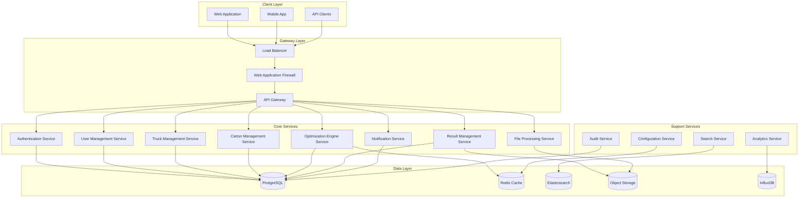

# TruckOptimum Enterprise Architecture Design
## BMAD Methodology Implementation for $70M ARR Scale

---

## 🎯 EXECUTIVE SUMMARY

### Current State Analysis
- **Monolithic Flask Application**: 123,988 lines in single app.py file
- **SQLite Database**: Not suitable for production enterprise workloads
- **Advanced 3D Algorithms**: 11 sophisticated algorithms with sub-2 second performance
- **Local Deployment**: Single executable model, no scalability
- **No Multi-tenancy**: Cannot support 150K enterprise customers
- **Limited Security**: Basic Flask security, no enterprise-grade features

### Target Enterprise Requirements
- **Revenue Target**: $70M ARR by Year 3
- **Customer Scale**: 150K potential customers (mix of SMB and Enterprise)
- **Performance**: Maintain sub-2 second optimization performance
- **Availability**: 99.9% uptime SLA for enterprise customers
- **Security**: SOC 2, GDPR, CCPA compliance
- **Scalability**: Support 10,000+ concurrent users

---

## 🏗️ BMAD FRAMEWORK APPLICATION

### **Business Layer** - Revenue & Customer Focus
- **Multi-Tenant SaaS**: Support SMB ($49-499/month) and Enterprise ($1K-10K/month) tiers
- **Usage-Based Pricing**: Optimization requests, API calls, storage usage
- **Enterprise Features**: Dedicated instances, SLA guarantees, priority support
- **Global Reach**: Multi-region deployment for international customers

### **Modular Layer** - Microservices Decomposition
- **Domain-Driven Design**: Business capability-focused services
- **Service Autonomy**: Independent deployment, scaling, and data management
- **API-First Design**: All services expose well-defined APIs
- **Event-Driven Architecture**: Asynchronous communication patterns

### **Architecture Layer** - Scalable Infrastructure
- **Cloud-Native Design**: Kubernetes orchestration, auto-scaling
- **Multi-Region Deployment**: Global availability and performance
- **Observability**: Comprehensive monitoring, logging, alerting
- **Security-First**: Zero-trust architecture, compliance-ready

### **Development Layer** - Modern Engineering Practices
- **CI/CD Pipeline**: Automated testing, security scanning, deployment
- **Infrastructure as Code**: Terraform for reproducible environments
- **DevSecOps**: Security integrated throughout development lifecycle
- **Site Reliability Engineering**: Proactive system reliability

---

## 🔧 SYSTEM ARCHITECTURE DESIGN

### **1. Microservices Architecture Overview**



### **2. Service Decomposition Strategy**

#### **Core Business Services**

**Authentication Service**
- JWT token management
- OAuth 2.0 + OpenID Connect
- Multi-factor authentication
- SSO integration
- Session management

**User Management Service**
- User profiles and preferences
- Role-based access control (RBAC)
- Tenant management
- Team collaboration features
- User analytics

**Truck Management Service**
- Truck fleet configuration
- Vehicle specifications and constraints
- Cost models and pricing
- Bulk import/export
- Truck utilization analytics

**Carton Management Service**
- Carton catalog and specifications
- Inventory management
- Dimension and weight validation
- Stackability and fragility rules
- Carton analytics

**Optimization Engine Service** (Performance Critical)
- 11 advanced 3D packing algorithms
- Algorithm auto-selection
- Real-time optimization processing
- Result caching and memoization
- Performance monitoring

**Result Management Service**
- Optimization result storage
- Visualization data generation
- Historical result analysis
- Export capabilities
- Cost savings calculations

**File Processing Service**
- CSV/Excel bulk upload processing
- Data validation and cleansing
- Background job processing
- Error reporting and validation
- Template generation

**Notification Service**
- Email notifications
- SMS alerts
- In-app notifications
- Webhook integrations
- Notification preferences

#### **Support Services**

**Configuration Service**
- Feature flags management
- Algorithm selection rules
- Tenant-specific configurations
- A/B testing support
- Dynamic configuration updates

**Audit Service**
- Compliance logging
- Activity tracking
- Data access logs
- Security event monitoring
- Audit report generation

**Analytics Service**
- Usage analytics and metrics
- Performance monitoring
- Business intelligence
- Custom dashboard creation
- Predictive analytics

**Search Service**
- Advanced search across entities
- Filtering and sorting
- Full-text search capabilities
- Search analytics
- Autocomplete functionality

---

## 📊 DATABASE DESIGN & MIGRATION STRATEGY

### **Production Database Architecture**

#### **Primary Database: PostgreSQL with Multi-Tenancy**

**Tenant Isolation Strategy:**
- **Schema-per-Tenant**: Enterprise customers (>$1K/month)
- **Row-Level Security**: SMB customers (shared tables with tenant_id)
- **Hybrid Approach**: Flexible based on customer tier

**Core Schema Design:**

```sql
-- Tenant Management
CREATE TABLE tenants (
    id UUID PRIMARY KEY DEFAULT gen_random_uuid(),
    name VARCHAR(255) NOT NULL,
    slug VARCHAR(100) UNIQUE NOT NULL,
    plan_type VARCHAR(50) NOT NULL, -- 'free', 'professional', 'enterprise'
    settings JSONB NOT NULL DEFAULT '{}',
    status VARCHAR(20) NOT NULL DEFAULT 'active',
    created_at TIMESTAMP WITH TIME ZONE DEFAULT CURRENT_TIMESTAMP,
    updated_at TIMESTAMP WITH TIME ZONE DEFAULT CURRENT_TIMESTAMP
);

-- User Management
CREATE TABLE users (
    id UUID PRIMARY KEY DEFAULT gen_random_uuid(),
    tenant_id UUID NOT NULL REFERENCES tenants(id) ON DELETE CASCADE,
    email VARCHAR(255) UNIQUE NOT NULL,
    password_hash VARCHAR(255),
    first_name VARCHAR(100),
    last_name VARCHAR(100),
    role VARCHAR(50) NOT NULL DEFAULT 'user', -- 'admin', 'user', 'viewer'
    permissions JSONB NOT NULL DEFAULT '[]',
    last_login_at TIMESTAMP WITH TIME ZONE,
    is_active BOOLEAN NOT NULL DEFAULT true,
    created_at TIMESTAMP WITH TIME ZONE DEFAULT CURRENT_TIMESTAMP,
    updated_at TIMESTAMP WITH TIME ZONE DEFAULT CURRENT_TIMESTAMP
);

-- Truck Management
CREATE TABLE trucks (
    id UUID PRIMARY KEY DEFAULT gen_random_uuid(),
    tenant_id UUID NOT NULL REFERENCES tenants(id) ON DELETE CASCADE,
    name VARCHAR(255) NOT NULL,
    truck_type VARCHAR(100) NOT NULL,
    length_cm DECIMAL(10,2) NOT NULL,
    width_cm DECIMAL(10,2) NOT NULL,
    height_cm DECIMAL(10,2) NOT NULL,
    max_weight_kg DECIMAL(10,2) NOT NULL,
    cost_per_km DECIMAL(10,4),
    cost_per_hour DECIMAL(10,2),
    is_active BOOLEAN NOT NULL DEFAULT true,
    metadata JSONB NOT NULL DEFAULT '{}',
    created_at TIMESTAMP WITH TIME ZONE DEFAULT CURRENT_TIMESTAMP,
    updated_at TIMESTAMP WITH TIME ZONE DEFAULT CURRENT_TIMESTAMP
);

-- Carton Management
CREATE TABLE cartons (
    id UUID PRIMARY KEY DEFAULT gen_random_uuid(),
    tenant_id UUID NOT NULL REFERENCES tenants(id) ON DELETE CASCADE,
    name VARCHAR(255) NOT NULL,
    sku VARCHAR(100),
    length_cm DECIMAL(10,2) NOT NULL,
    width_cm DECIMAL(10,2) NOT NULL,
    height_cm DECIMAL(10,2) NOT NULL,
    weight_kg DECIMAL(10,2) NOT NULL,
    is_fragile BOOLEAN NOT NULL DEFAULT false,
    is_stackable BOOLEAN NOT NULL DEFAULT true,
    stack_limit INTEGER DEFAULT NULL,
    metadata JSONB NOT NULL DEFAULT '{}',
    created_at TIMESTAMP WITH TIME ZONE DEFAULT CURRENT_TIMESTAMP,
    updated_at TIMESTAMP WITH TIME ZONE DEFAULT CURRENT_TIMESTAMP
);

-- Optimization Jobs
CREATE TABLE optimization_jobs (
    id UUID PRIMARY KEY DEFAULT gen_random_uuid(),
    tenant_id UUID NOT NULL REFERENCES tenants(id) ON DELETE CASCADE,
    user_id UUID NOT NULL REFERENCES users(id) ON DELETE CASCADE,
    job_name VARCHAR(255),
    algorithm_used VARCHAR(100) NOT NULL,
    status VARCHAR(50) NOT NULL DEFAULT 'pending', -- 'pending', 'running', 'completed', 'failed'
    execution_time_ms INTEGER,
    error_message TEXT,
    input_data JSONB NOT NULL,
    result_data JSONB,
    created_at TIMESTAMP WITH TIME ZONE DEFAULT CURRENT_TIMESTAMP,
    updated_at TIMESTAMP WITH TIME ZONE DEFAULT CURRENT_TIMESTAMP
);

-- Optimization Results
CREATE TABLE optimization_results (
    id UUID PRIMARY KEY DEFAULT gen_random_uuid(),
    job_id UUID NOT NULL REFERENCES optimization_jobs(id) ON DELETE CASCADE,
    truck_assignments JSONB NOT NULL,
    utilization_rate DECIMAL(5,2) NOT NULL,
    total_cost DECIMAL(12,2),
    cost_savings DECIMAL(12,2),
    trucks_used INTEGER NOT NULL,
    visualization_data JSONB,
    created_at TIMESTAMP WITH TIME ZONE DEFAULT CURRENT_TIMESTAMP
);

-- Audit Logs
CREATE TABLE audit_logs (
    id UUID PRIMARY KEY DEFAULT gen_random_uuid(),
    tenant_id UUID NOT NULL REFERENCES tenants(id) ON DELETE CASCADE,
    user_id UUID REFERENCES users(id) ON DELETE SET NULL,
    action VARCHAR(100) NOT NULL,
    resource_type VARCHAR(100) NOT NULL,
    resource_id UUID,
    old_values JSONB,
    new_values JSONB,
    ip_address INET,
    user_agent TEXT,
    created_at TIMESTAMP WITH TIME ZONE DEFAULT CURRENT_TIMESTAMP
);
```

**Indexing Strategy:**
```sql
-- Performance indexes
CREATE INDEX idx_tenants_slug ON tenants(slug);
CREATE INDEX idx_users_tenant_email ON users(tenant_id, email);
CREATE INDEX idx_trucks_tenant_active ON trucks(tenant_id, is_active);
CREATE INDEX idx_cartons_tenant_sku ON cartons(tenant_id, sku);
CREATE INDEX idx_optimization_jobs_tenant_status ON optimization_jobs(tenant_id, status);
CREATE INDEX idx_optimization_jobs_created_at ON optimization_jobs(created_at DESC);
CREATE INDEX idx_audit_logs_tenant_created_at ON audit_logs(tenant_id, created_at DESC);

-- Search indexes
CREATE INDEX idx_trucks_search ON trucks USING gin(to_tsvector('english', name || ' ' || truck_type));
CREATE INDEX idx_cartons_search ON cartons USING gin(to_tsvector('english', name || ' ' || COALESCE(sku, '')));
```

#### **Supporting Data Stores**

**Redis Cache Architecture:**
- **Session Storage**: User sessions and JWT tokens
- **Application Cache**: Frequently accessed data (truck catalogs, user preferences)
- **Result Cache**: Optimization results for duplicate requests
- **Rate Limiting**: Request rate tracking per user/tenant
- **Real-time Data**: Live optimization status updates

**Elasticsearch Setup:**
- **Advanced Search**: Full-text search across trucks, cartons, results
- **Analytics**: User behavior tracking and business metrics
- **Log Aggregation**: Application logs and audit trails
- **Reporting**: Custom dashboard data and reporting

**Object Storage (S3/MinIO):**
- **File Uploads**: CSV/Excel files for bulk operations
- **Result Exports**: Generated reports and visualizations
- **Backup Storage**: Database backups and disaster recovery
- **Static Assets**: UI assets and documentation

**InfluxDB (Time-Series):**
- **Performance Metrics**: API response times, optimization execution times
- **System Metrics**: CPU, memory, database performance
- **Business Metrics**: Daily active users, optimization requests
- **Custom Metrics**: Tenant-specific KPIs and analytics

### **Migration Strategy from SQLite**

#### **Phase 1: Direct Migration (Week 1-2)**
1. **Schema Translation**: Convert SQLite schema to PostgreSQL
2. **Data Migration**: Use ETL tools to migrate existing data
3. **Application Update**: Update database connection strings
4. **Testing**: Comprehensive testing with production data copy
5. **Rollback Plan**: Keep SQLite as backup during transition

#### **Phase 2: Schema Optimization (Week 3-4)**
1. **Normalization**: Optimize database relationships
2. **Indexing**: Implement performance indexes
3. **Constraints**: Add proper foreign keys and validation
4. **Partitioning**: Implement table partitioning for large tables
5. **Performance Testing**: Load testing with optimized schema

#### **Phase 3: Multi-Tenancy Implementation (Week 5-8)**
1. **Tenant Architecture**: Implement schema-per-tenant for enterprises
2. **Row-Level Security**: Configure RLS for shared tables
3. **Data Migration**: Migrate single-tenant data to multi-tenant structure
4. **Access Control**: Implement tenant isolation
5. **Testing**: Multi-tenant functionality testing

#### **Phase 4: Microservices Database Separation (Week 9-16)**
1. **Service Databases**: Create separate databases per service
2. **Data Synchronization**: Implement event-driven data sync
3. **Transaction Management**: Implement distributed transaction patterns
4. **Consistency**: Ensure eventual consistency across services
5. **Monitoring**: Database performance monitoring per service

---

## 🔐 SECURITY ARCHITECTURE

### **Authentication & Authorization Framework**

#### **Modern Authentication Stack**
- **OAuth 2.0 + OpenID Connect**: Industry-standard authentication
- **JWT Tokens**: Short-lived access tokens (15 minutes) + refresh tokens (30 days)
- **Multi-Factor Authentication**: TOTP, SMS, email-based MFA
- **SSO Integration**: Google, Microsoft, Okta, SAML providers
- **API Key Management**: Secure API keys for programmatic access

#### **Role-Based Access Control (RBAC)**

**Roles & Permissions Matrix:**

| Role | Trucks | Cartons | Optimization | Reports | Users | Settings |
|------|--------|---------|--------------|---------|-------|----------|
| **Super Admin** | Full | Full | Full | Full | Full | Full |
| **Admin** | Full | Full | Full | Full | Manage | Configure |
| **Manager** | Full | Full | Full | View | View | View |
| **User** | View/Edit Own | View/Edit Own | Execute | View Own | View Own | View |
| **Viewer** | View | View | View Results | View | View Own | View |
| **API User** | API Access | API Access | API Access | API Access | None | None |

**Permission Granularity:**
- **Create**: Add new entities
- **Read**: View entities and data
- **Update**: Modify existing entities
- **Delete**: Remove entities
- **Execute**: Run optimizations
- **Manage**: User and permission management
- **Configure**: System configuration

#### **Data Protection & Encryption**

**Encryption Strategy:**
- **At Rest**: AES-256 encryption for all databases
- **In Transit**: TLS 1.3 for all API communications
- **Field-Level**: Encrypt PII and sensitive business data
- **Key Management**: AWS KMS/HashiCorp Vault for key rotation

**Data Privacy Controls:**
- **Data Classification**: Categorize data sensitivity levels
- **Access Logging**: Log all data access and modifications
- **Data Retention**: Automated data purging policies
- **Right to Deletion**: GDPR-compliant data removal
- **Data Masking**: PII protection in non-production environments

### **Security Layers & Controls**

#### **Network Security**
```
Internet → CloudFlare/WAF → Load Balancer → API Gateway → Services
```

**Web Application Firewall (WAF):**
- **OWASP Top 10 Protection**: SQL injection, XSS, CSRF prevention
- **Rate Limiting**: DDoS protection and abuse prevention
- **IP Allowlisting**: Restricted access for enterprise customers
- **Geographic Filtering**: Block requests from restricted countries
- **Bot Detection**: Automated bot traffic filtering

**API Gateway Security:**
- **API Key Validation**: Secure API key management
- **Rate Limiting**: Per-user and per-tenant limits
- **Request Validation**: Schema validation and input sanitization
- **Audit Logging**: Complete API access logging
- **Circuit Breaker**: Prevent cascade failures

#### **Application Security**

**Secure Development Practices:**
- **Security Code Review**: Automated and manual code reviews
- **Dependency Scanning**: Automated vulnerability scanning
- **Static Analysis**: SAST tools in CI/CD pipeline
- **Dynamic Testing**: DAST tools for runtime security testing
- **Penetration Testing**: Regular third-party security assessments

**Runtime Security:**
- **Container Security**: Minimal base images, no root users
- **Secrets Management**: External secret stores, no hardcoded secrets
- **Input Validation**: Comprehensive input sanitization
- **Output Encoding**: XSS prevention through proper encoding
- **Error Handling**: Secure error messages, no information disclosure

### **Compliance Framework**

#### **SOC 2 Type II Compliance**
- **Security**: Access controls and authentication
- **Availability**: System uptime and disaster recovery
- **Processing Integrity**: Data processing accuracy
- **Confidentiality**: Data protection and encryption
- **Privacy**: Personal information handling

#### **GDPR Compliance (EU Customers)**
- **Lawful Basis**: Consent and legitimate interest documentation
- **Data Subject Rights**: Access, portability, deletion requests
- **Privacy by Design**: Built-in privacy controls
- **Data Protection Officer**: Designated privacy officer
- **Breach Notification**: 72-hour breach notification procedures

#### **CCPA Compliance (California Customers)**
- **Consumer Rights**: Access, deletion, opt-out rights
- **Data Categories**: Classification of personal information
- **Business Purposes**: Documented data usage purposes
- **Third-Party Sharing**: Disclosure of data sharing practices
- **Opt-Out Mechanisms**: "Do Not Sell" request handling

---

## ⚡ SCALABILITY & PERFORMANCE DESIGN

### **Horizontal Scaling Architecture**

#### **Auto-Scaling Strategy**
- **Application Scaling**: CPU/memory-based with predictive scaling
- **Database Scaling**: Read replicas and connection pooling
- **Cache Scaling**: Redis cluster with automatic failover
- **Load Balancing**: Application load balancer with health checks

**Scaling Tiers:**
```
Startup Tier (1-100 users):
- 2 application servers
- 1 database server with backup
- 1 Redis cache server
- Basic monitoring

Growth Tier (100-1,000 users):
- 5+ application servers (auto-scaling)
- Primary DB + 2 read replicas
- Redis cluster (3 nodes)
- Full monitoring stack

Enterprise Tier (1,000+ users):
- 10+ application servers across AZs
- Database cluster with failover
- Redis cluster with sharding
- Multi-region deployment
```

#### **Caching Strategy**

**Multi-Level Cache Architecture:**

**L1 Cache (Application Level):**
- **In-Memory Cache**: Frequently accessed data (truck catalogs, user preferences)
- **Result Memoization**: Cache optimization results for identical inputs
- **Configuration Cache**: Feature flags and system configurations
- **TTL Strategy**: 5-30 minutes based on data volatility

**L2 Cache (Distributed Redis):**
- **Session Storage**: User sessions and authentication tokens
- **API Response Cache**: Cache API responses for read-heavy operations
- **Database Query Cache**: Cache expensive database queries
- **Real-Time Data**: Live optimization status and progress updates
- **TTL Strategy**: 1 hour to 24 hours based on data type

**L3 Cache (CDN):**
- **Static Assets**: JavaScript, CSS, images
- **API Response Cache**: Cache public API responses
- **Geographic Distribution**: Edge locations for global performance
- **TTL Strategy**: 24 hours to 30 days for static content

#### **Performance Optimization**

**Critical Performance Requirements:**
- **Optimization Engine**: < 2 seconds (maintained from current system)
- **API Response Time**: < 200ms for CRUD operations
- **UI Load Time**: < 3 seconds for initial page load
- **Database Queries**: < 100ms for simple queries, < 500ms for complex queries
- **File Uploads**: Support up to 10MB files with progress tracking

**Optimization Engine Performance:**
```python
# Algorithm Selection Strategy (Pseudo-code)
class OptimizationEngine:
    def __init__(self):
        self.algorithm_cache = {}
        self.result_cache = {}
        self.performance_metrics = {}
    
    def optimize(self, trucks, cartons, constraints):
        # Generate cache key from input parameters
        cache_key = self.generate_cache_key(trucks, cartons, constraints)
        
        # Check result cache first
        if cache_key in self.result_cache:
            return self.result_cache[cache_key]
        
        # Select best algorithm based on problem characteristics
        algorithm = self.select_algorithm(trucks, cartons, constraints)
        
        # Execute optimization with performance monitoring
        start_time = time.time()
        result = algorithm.optimize(trucks, cartons, constraints)
        execution_time = time.time() - start_time
        
        # Cache result and update metrics
        self.result_cache[cache_key] = result
        self.update_performance_metrics(algorithm, execution_time)
        
        return result
    
    def select_algorithm(self, trucks, cartons, constraints):
        """Select optimal algorithm based on problem characteristics"""
        problem_size = len(trucks) * len(cartons)
        
        if problem_size < 100:
            return self.algorithms['genetic_optimized']
        elif problem_size < 1000:
            return self.algorithms['hybrid_heuristic']
        else:
            return self.algorithms['fast_fit_decreasing']
```

**Database Performance:**
- **Connection Pooling**: Efficient connection management
- **Query Optimization**: Indexed queries and query plan analysis
- **Read Replicas**: Separate read/write operations
- **Partitioning**: Table partitioning for large datasets
- **Archiving**: Automated data archiving for historical data

**Real-Time Performance Monitoring:**
- **APM Integration**: New Relic/Datadog for application performance
- **Custom Metrics**: Business-specific performance indicators
- **Performance Budgets**: Automated performance regression detection
- **Load Testing**: Continuous load testing in staging environment

---

## 🔗 INTEGRATION ARCHITECTURE

### **Third-Party Service Integration**

#### **Payment & Billing Integration**

**Stripe Integration:**
```javascript
// Subscription Management API
{
  "customer": {
    "id": "cus_tenant_123",
    "email": "admin@company.com",
    "metadata": {
      "tenant_id": "tenant_123",
      "plan_type": "enterprise"
    }
  },
  "subscription": {
    "id": "sub_123",
    "plan": "enterprise_monthly",
    "items": [
      {
        "plan": "optimization_requests",
        "quantity": 1000  // Usage-based pricing
      }
    ],
    "usage_record": {
      "subscription_item": "si_123",
      "quantity": 150,  // Actual usage
      "timestamp": 1634567890
    }
  }
}
```

**Billing Features:**
- **Usage Tracking**: Real-time optimization request counting
- **Overage Handling**: Automatic billing for usage overages
- **Plan Upgrades**: Seamless plan change management
- **Tax Management**: Automated tax calculation by region
- **Invoice Generation**: Automated invoice creation and delivery

#### **Communication Integration**

**Email Service (SendGrid/AWS SES):**
- **Transactional Emails**: Welcome, password reset, notifications
- **Bulk Email**: Newsletter, feature announcements
- **Email Templates**: Branded templates with dynamic content
- **Delivery Analytics**: Open rates, click-through rates
- **Suppression Management**: Bounce and unsubscribe handling

**SMS Service (Twilio):**
- **Critical Alerts**: System downtime, security alerts
- **Two-Factor Authentication**: SMS-based MFA codes
- **Usage Notifications**: High usage warnings, limit alerts
- **International Support**: Global SMS delivery
- **Opt-Out Management**: SMS preference management

#### **Analytics Integration**

**Business Analytics (Mixpanel/Amplitude):**
```javascript
// User Event Tracking
{
  "event": "optimization_completed",
  "user_id": "user_123",
  "tenant_id": "tenant_456",
  "properties": {
    "algorithm_used": "genetic_optimized",
    "execution_time_ms": 1850,
    "trucks_count": 5,
    "cartons_count": 150,
    "utilization_rate": 0.87,
    "cost_savings": 245.50
  },
  "timestamp": "2025-01-15T10:30:00Z"
}
```

**Product Analytics:**
- **User Behavior**: Feature usage patterns, user journeys
- **Performance Analytics**: Algorithm performance, optimization success rates
- **Business Metrics**: Revenue per customer, churn prediction
- **A/B Testing**: Feature flag analytics and conversion tracking
- **Custom Dashboards**: Business intelligence and reporting

#### **Integration Architecture Patterns**

**API-First Integration:**
- **RESTful APIs**: Standard HTTP-based integration
- **Webhook Support**: Real-time event notifications
- **GraphQL Gateway**: Flexible data querying for clients
- **Rate Limiting**: Per-integration rate limiting
- **Error Handling**: Comprehensive error handling and retries

**Event-Driven Integration:**
```python
# Event-Driven Architecture Example
class EventBus:
    def __init__(self):
        self.handlers = {}
    
    def publish(self, event_type, event_data):
        """Publish event to all registered handlers"""
        if event_type in self.handlers:
            for handler in self.handlers[event_type]:
                handler.handle(event_data)
    
    def subscribe(self, event_type, handler):
        """Subscribe handler to specific event type"""
        if event_type not in self.handlers:
            self.handlers[event_type] = []
        self.handlers[event_type].append(handler)

# Usage Example
event_bus = EventBus()

# When optimization completes
event_bus.publish('optimization_completed', {
    'tenant_id': 'tenant_123',
    'user_id': 'user_456',
    'job_id': 'job_789',
    'result': optimization_result
})

# Handlers automatically process the event
# - Update analytics
# - Send notifications  
# - Update billing usage
# - Cache results
```

---

## 🚀 DEPLOYMENT ARCHITECTURE

### **CI/CD Pipeline Design**

#### **Automated Pipeline Flow**
```yaml
# GitHub Actions Pipeline
name: TruckOptimum CI/CD Pipeline

on:
  push:
    branches: [main, develop]
  pull_request:
    branches: [main]

jobs:
  test:
    runs-on: ubuntu-latest
    steps:
      - uses: actions/checkout@v3
      - name: Setup Python
        uses: actions/setup-python@v4
        with:
          python-version: '3.11'
      
      - name: Install dependencies
        run: |
          pip install -r requirements.txt
          pip install -r requirements-test.txt
      
      - name: Run unit tests
        run: pytest tests/unit/ --cov=app
      
      - name: Run integration tests
        run: pytest tests/integration/
      
      - name: Security scan
        run: |
          safety check
          bandit -r app/
      
      - name: Code quality
        run: |
          flake8 app/
          black --check app/
          mypy app/

  build:
    needs: test
    runs-on: ubuntu-latest
    steps:
      - uses: actions/checkout@v3
      
      - name: Build Docker image
        run: |
          docker build -t truckoptimum:${{ github.sha }} .
          docker tag truckoptimum:${{ github.sha }} truckoptimum:latest
      
      - name: Push to registry
        run: |
          docker push truckoptimum:${{ github.sha }}
          docker push truckoptimum:latest

  deploy-staging:
    needs: build
    runs-on: ubuntu-latest
    if: github.ref == 'refs/heads/develop'
    steps:
      - name: Deploy to staging
        run: |
          kubectl set image deployment/truckoptimum \
            truckoptimum=truckoptimum:${{ github.sha }} \
            --namespace=staging

  deploy-production:
    needs: build
    runs-on: ubuntu-latest
    if: github.ref == 'refs/heads/main'
    steps:
      - name: Deploy to production
        run: |
          kubectl set image deployment/truckoptimum \
            truckoptimum=truckoptimum:${{ github.sha }} \
            --namespace=production
```

#### **Infrastructure as Code (Terraform)**

**AWS Infrastructure Setup:**
```hcl
# terraform/main.tf
provider "aws" {
  region = var.aws_region
}

# EKS Cluster
module "eks" {
  source = "terraform-aws-modules/eks/aws"
  
  cluster_name    = "truckoptimum-${var.environment}"
  cluster_version = "1.25"
  
  vpc_id     = module.vpc.vpc_id
  subnet_ids = module.vpc.private_subnets
  
  node_groups = {
    main = {
      desired_capacity = 3
      max_capacity     = 10
      min_capacity     = 1
      
      instance_types = ["t3.medium", "t3.large"]
      
      k8s_labels = {
        Environment = var.environment
        Application = "truckoptimum"
      }
    }
  }
}

# RDS PostgreSQL
resource "aws_db_instance" "main" {
  identifier = "truckoptimum-${var.environment}"
  
  engine         = "postgres"
  engine_version = "14.9"
  instance_class = "db.t3.micro"
  
  allocated_storage     = 20
  max_allocated_storage = 100
  storage_encrypted     = true
  
  db_name  = "truckoptimum"
  username = var.db_username
  password = var.db_password
  
  vpc_security_group_ids = [aws_security_group.rds.id]
  db_subnet_group_name   = aws_db_subnet_group.main.name
  
  backup_retention_period = 7
  backup_window          = "03:00-04:00"
  maintenance_window     = "sun:04:00-sun:05:00"
  
  skip_final_snapshot = var.environment != "production"
}

# ElastiCache Redis
resource "aws_elasticache_subnet_group" "main" {
  name       = "truckoptimum-${var.environment}"
  subnet_ids = module.vpc.private_subnets
}

resource "aws_elasticache_replication_group" "main" {
  replication_group_id         = "truckoptimum-${var.environment}"
  description                  = "TruckOptimum Redis cluster"
  
  node_type            = "cache.t3.micro"
  port                 = 6379
  parameter_group_name = "default.redis7"
  
  num_cache_clusters = 2
  
  subnet_group_name = aws_elasticache_subnet_group.main.name
  security_group_ids = [aws_security_group.redis.id]
  
  at_rest_encryption_enabled = true
  transit_encryption_enabled = true
}
```

### **Kubernetes Deployment**

#### **Service Deployment Configuration**
```yaml
# k8s/deployments/optimization-engine.yaml
apiVersion: apps/v1
kind: Deployment
metadata:
  name: optimization-engine
  labels:
    app: optimization-engine
spec:
  replicas: 3
  selector:
    matchLabels:
      app: optimization-engine
  template:
    metadata:
      labels:
        app: optimization-engine
    spec:
      containers:
      - name: optimization-engine
        image: truckoptimum/optimization-engine:latest
        ports:
        - containerPort: 8000
        env:
        - name: DATABASE_URL
          valueFrom:
            secretKeyRef:
              name: database-secret
              key: url
        - name: REDIS_URL
          valueFrom:
            secretKeyRef:
              name: redis-secret
              key: url
        resources:
          requests:
            memory: "512Mi"
            cpu: "250m"
          limits:
            memory: "1Gi"
            cpu: "500m"
        livenessProbe:
          httpGet:
            path: /health
            port: 8000
          initialDelaySeconds: 30
          periodSeconds: 10
        readinessProbe:
          httpGet:
            path: /ready
            port: 8000
          initialDelaySeconds: 5
          periodSeconds: 5

---
apiVersion: v1
kind: Service
metadata:
  name: optimization-engine-service
spec:
  selector:
    app: optimization-engine
  ports:
    - protocol: TCP
      port: 80
      targetPort: 8000
  type: ClusterIP

---
apiVersion: autoscaling/v2
kind: HorizontalPodAutoscaler
metadata:
  name: optimization-engine-hpa
spec:
  scaleTargetRef:
    apiVersion: apps/v1
    kind: Deployment
    name: optimization-engine
  minReplicas: 3
  maxReplicas: 20
  metrics:
  - type: Resource
    resource:
      name: cpu
      target:
        type: Utilization
        averageUtilization: 70
  - type: Resource
    resource:
      name: memory
      target:
        type: Utilization
        averageUtilization: 80
```

#### **Environment Management**

**Development Environment:**
- **Local Docker**: Docker Compose for local development
- **Hot Reloading**: Automatic code reloading during development
- **Test Data**: Seeded test data for development
- **Mock Services**: Mock external API integrations
- **Debug Logging**: Verbose logging for debugging

**Staging Environment:**
- **Production-Like**: Full replica of production environment
- **Automated Deployment**: Automatic deployment from develop branch
- **Integration Testing**: Full integration test suite execution
- **Performance Testing**: Load testing and performance validation
- **Data Sync**: Regular production data sync (anonymized)

**Production Environment:**
- **Multi-AZ Deployment**: High availability across availability zones
- **Blue-Green Deployment**: Zero-downtime deployments
- **Monitoring**: Comprehensive monitoring and alerting
- **Backup Strategy**: Automated backups and disaster recovery
- **Security Hardening**: Production security configurations

---

## 📊 MONITORING & OBSERVABILITY

### **Comprehensive Monitoring Stack**

#### **Application Performance Monitoring (APM)**
- **New Relic/Datadog**: Real-time application performance monitoring
- **Custom Metrics**: Business-specific performance indicators
- **Error Tracking**: Real-time error detection and alerting
- **Performance Profiling**: Code-level performance analysis
- **User Experience**: Real user monitoring and synthetic testing

#### **Infrastructure Monitoring**
**Prometheus + Grafana Stack:**
```yaml
# Monitoring Configuration
monitoring:
  prometheus:
    scrape_configs:
      - job_name: 'truckoptimum-api'
        static_configs:
          - targets: ['api:8000']
        metrics_path: '/metrics'
        scrape_interval: 15s
        
      - job_name: 'optimization-engine'
        static_configs:
          - targets: ['optimization-engine:8000']
        metrics_path: '/metrics'
        scrape_interval: 5s  # More frequent for critical service
        
      - job_name: 'postgresql'
        static_configs:
          - targets: ['postgres-exporter:9187']
        
      - job_name: 'redis'
        static_configs:
          - targets: ['redis-exporter:9121']

  grafana:
    dashboards:
      - name: "TruckOptimum Overview"
        panels:
          - api_response_time
          - optimization_execution_time
          - active_users
          - error_rate
          - database_performance
          
      - name: "Business Metrics"
        panels:
          - daily_optimizations
          - cost_savings_generated
          - user_growth
          - revenue_metrics
```

#### **Log Management (ELK Stack)**
```yaml
# Logging Configuration
logging:
  elasticsearch:
    cluster_name: "truckoptimum-logs"
    nodes: 3
    indices:
      - name: "application-logs"
        retention: "30d"
      - name: "audit-logs"
        retention: "7y"  # Compliance requirement
      - name: "performance-logs"
        retention: "90d"
        
  logstash:
    pipelines:
      - name: "application-pipeline"
        config: |
          input {
            beats {
              port => 5044
            }
          }
          filter {
            if [fields][service] == "optimization-engine" {
              grok {
                match => { "message" => "%{TIMESTAMP_ISO8601:timestamp} %{LOGLEVEL:level} %{GREEDYDATA:message}" }
              }
              if [level] == "ERROR" {
                mutate {
                  add_tag => ["alert"]
                }
              }
            }
          }
          output {
            elasticsearch {
              hosts => ["elasticsearch:9200"]
              index => "application-logs-%{+YYYY.MM.dd}"
            }
          }
          
  kibana:
    dashboards:
      - name: "Error Analysis"
      - name: "Performance Trends"
      - name: "Audit Trail"
      - name: "User Activity"
```

### **Alerting Strategy**

#### **Alert Categories & Thresholds**

**Critical Alerts (Immediate Response):**
- **System Down**: API gateway or core services unavailable
- **Database Failure**: Primary database connection lost
- **Security Breach**: Unauthorized access attempts or data breach
- **Performance Degradation**: API response time > 5 seconds
- **High Error Rate**: Error rate > 5% over 5 minutes

**Warning Alerts (Response within 1 hour):**
- **High CPU Usage**: CPU utilization > 80% for 10 minutes
- **Memory Usage**: Memory utilization > 85% for 10 minutes
- **Disk Space**: Disk usage > 85%
- **Queue Backup**: Job queue depth > 1000 items
- **Optimization Timeouts**: Optimization taking > 10 seconds

**Information Alerts (Daily Review):**
- **New User Signups**: Daily signup numbers
- **Usage Patterns**: Unusual usage spikes or drops
- **Performance Trends**: Weekly performance trend reports
- **Cost Monitoring**: Cloud cost increases > 20%
- **Security Reports**: Daily security scan results

#### **Alerting Channels**
```yaml
# Alert Manager Configuration
alerting:
  channels:
    - name: "critical"
      type: "pagerduty"
      config:
        service_key: "CRITICAL_SERVICE_KEY"
        escalation_policy: "immediate"
        
    - name: "warning"
      type: "slack"
      config:
        webhook_url: "SLACK_WEBHOOK_URL"
        channel: "#alerts-warning"
        
    - name: "info"
      type: "email"
      config:
        to: ["ops-team@truckoptimum.com"]
        subject_prefix: "[TruckOptimum]"
        
  rules:
    - name: "API Response Time"
      condition: "avg(api_response_time) > 2000"
      for: "5m"
      labels:
        severity: "critical"
      annotations:
        summary: "API response time is above 2 seconds"
        
    - name: "Optimization Engine Performance"
      condition: "avg(optimization_execution_time) > 5000"
      for: "2m"
      labels:
        severity: "warning"
      annotations:
        summary: "Optimization taking longer than 5 seconds"
```

### **Business Intelligence & Analytics**

#### **Key Performance Indicators (KPIs)**

**Business Metrics:**
- **Monthly Recurring Revenue (MRR)**: Track revenue growth
- **Customer Acquisition Cost (CAC)**: Marketing efficiency
- **Customer Lifetime Value (CLV)**: Long-term value metrics
- **Churn Rate**: Customer retention analysis
- **Net Promoter Score (NPS)**: Customer satisfaction

**Product Metrics:**
- **Daily/Monthly Active Users**: User engagement
- **Optimization Requests**: Core usage metric
- **Average Cost Savings**: Value delivered to customers
- **Algorithm Performance**: Technical performance metrics
- **Feature Adoption**: New feature usage rates

**Technical Metrics:**
- **API Response Time**: Performance tracking
- **Error Rate**: System reliability
- **Uptime**: System availability
- **Database Performance**: Data layer health
- **Cache Hit Rate**: Caching efficiency

#### **Custom Analytics Dashboard**
```python
# Business Analytics API
class AnalyticsService:
    def __init__(self, influx_client, postgres_client):
        self.influx = influx_client
        self.postgres = postgres_client
    
    def get_business_metrics(self, tenant_id, date_range):
        """Get comprehensive business metrics for tenant"""
        return {
            'revenue_metrics': self.get_revenue_metrics(tenant_id, date_range),
            'usage_metrics': self.get_usage_metrics(tenant_id, date_range),
            'performance_metrics': self.get_performance_metrics(tenant_id, date_range),
            'cost_savings': self.calculate_cost_savings(tenant_id, date_range)
        }
    
    def get_usage_metrics(self, tenant_id, date_range):
        """Track usage patterns and trends"""
        query = f"""
        SELECT 
            DATE(created_at) as date,
            COUNT(*) as optimization_count,
            AVG(execution_time_ms) as avg_execution_time,
            AVG(utilization_rate) as avg_utilization
        FROM optimization_jobs 
        WHERE tenant_id = '{tenant_id}'
        AND created_at >= '{date_range.start}'
        AND created_at <= '{date_range.end}'
        GROUP BY DATE(created_at)
        ORDER BY date
        """
        return self.postgres.execute(query)
    
    def calculate_cost_savings(self, tenant_id, date_range):
        """Calculate total cost savings delivered"""
        query = f"""
        SELECT 
            SUM(cost_savings) as total_savings,
            AVG(cost_savings) as avg_savings_per_optimization,
            COUNT(*) as total_optimizations
        FROM optimization_results r
        JOIN optimization_jobs j ON r.job_id = j.id
        WHERE j.tenant_id = '{tenant_id}'
        AND j.created_at >= '{date_range.start}'
        AND j.created_at <= '{date_range.end}'
        """
        return self.postgres.execute_one(query)
```

---

## 🔄 MIGRATION ROADMAP & IMPLEMENTATION PHASES

### **Phase 1: Foundation (Months 1-2)**

#### **Infrastructure Setup**
- **Cloud Environment**: AWS/Azure setup with Terraform
- **CI/CD Pipeline**: GitHub Actions with automated testing
- **Monitoring**: Basic monitoring with Prometheus/Grafana
- **Security**: Basic security hardening and SSL certificates
- **Database**: PostgreSQL setup with read replica

#### **Application Modernization**
- **Containerization**: Dockerize existing Flask application
- **Database Migration**: SQLite to PostgreSQL migration
- **API Gateway**: Kong/AWS API Gateway setup
- **Basic Auth**: JWT-based authentication implementation
- **Load Testing**: Performance baseline establishment

**Success Metrics:**
- ✅ Application running in containers
- ✅ PostgreSQL database migration complete
- ✅ API response times < 200ms maintained
- ✅ Optimization performance < 2 seconds maintained
- ✅ Basic monitoring and alerting active

### **Phase 2: Multi-Tenancy & Security (Months 3-4)**

#### **Multi-Tenant Architecture**
- **Schema Design**: Implement tenant isolation
- **User Management**: Complete RBAC implementation  
- **Data Separation**: Tenant data isolation
- **Billing Integration**: Stripe integration for subscriptions
- **Admin Portal**: Tenant management interface

#### **Security Hardening**
- **OAuth Integration**: SSO with major providers
- **MFA Implementation**: Two-factor authentication
- **Encryption**: Data encryption at rest and in transit
- **Audit Logging**: Comprehensive audit trail
- **Compliance**: SOC 2 Type II preparation

**Success Metrics:**
- ✅ Multi-tenant data isolation working
- ✅ Authentication system supporting SSO
- ✅ Billing system processing payments
- ✅ Security audit passing
- ✅ First enterprise customers onboarded

### **Phase 3: Microservices Decomposition (Months 5-7)**

#### **Service Separation**
- **Optimization Engine**: Extract as independent service
- **User Management**: Separate authentication service
- **Truck/Carton Management**: Domain-specific services  
- **File Processing**: Async file processing service
- **Notification Service**: Email/SMS notification service

#### **Event-Driven Architecture**
- **Message Queue**: RabbitMQ/AWS SQS implementation
- **Event Sourcing**: Event-driven data synchronization
- **API Gateway**: Service routing and composition
- **Service Discovery**: Kubernetes service discovery
- **Distributed Tracing**: Request tracing across services

**Success Metrics:**
- ✅ 5+ microservices deployed independently
- ✅ Event-driven communication working
- ✅ Service-to-service authentication secure
- ✅ End-to-end request tracing active
- ✅ No performance regression from decomposition

### **Phase 4: Scale & Optimization (Months 8-10)**

#### **Performance Optimization**
- **Caching Strategy**: Multi-level caching implementation
- **Database Optimization**: Query optimization and indexing
- **Auto-Scaling**: Kubernetes HPA implementation
- **CDN Integration**: Global content delivery
- **Algorithm Optimization**: Performance tuning for scale

#### **Advanced Features**
- **Advanced Analytics**: Business intelligence dashboard
- **API Versioning**: Comprehensive API versioning
- **Advanced Search**: Elasticsearch integration
- **Mobile API**: Mobile-optimized API endpoints
- **Webhooks**: Real-time integration capabilities

**Success Metrics:**
- ✅ Support 10,000+ concurrent users
- ✅ API response times < 100ms for cached requests
- ✅ 99.9% uptime achieved
- ✅ Advanced analytics providing insights
- ✅ Mobile API supporting native apps

### **Phase 5: Global Scale & Enterprise (Months 11-12)**

#### **Global Deployment**
- **Multi-Region**: Deploy to 3+ AWS regions
- **Global Load Balancing**: Route 53 with health checks
- **Data Replication**: Cross-region data replication
- **Compliance**: GDPR, CCPA full compliance
- **Enterprise Features**: Dedicated instances, SLA guarantees

#### **Advanced Integrations**
- **ERP Integration**: SAP, Oracle, NetSuite connectors
- **WMS Integration**: Warehouse management system APIs
- **TMS Integration**: Transportation management systems
- **AI/ML Features**: Advanced optimization recommendations
- **Custom Development**: Enterprise custom development program

**Success Metrics:**
- ✅ Global deployment across 3 regions
- ✅ Enterprise SLA compliance (99.95% uptime)
- ✅ Integration marketplace with 10+ connectors
- ✅ $70M ARR target trajectory achieved
- ✅ 150K+ customer capacity demonstrated

---

## 💰 COST ANALYSIS & ROI PROJECTION

### **Infrastructure Cost Breakdown**

#### **Phase 1 Costs (Foundation)**
```
AWS Infrastructure (Monthly):
- ECS/EKS Cluster: $150
- RDS PostgreSQL (db.t3.medium): $120
- ElastiCache Redis (cache.t3.micro): $50
- Application Load Balancer: $25
- CloudWatch + Logs: $30
- Total Phase 1: $375/month ($4,500/year)

Third-Party Services:
- Monitoring (New Relic): $100/month
- CI/CD (GitHub Actions): $50/month
- SSL Certificates: $0 (Let's Encrypt)
- Total Services: $150/month ($1,800/year)

Phase 1 Total: $525/month ($6,300/year)
```

#### **Phase 5 Costs (Global Scale)**
```
AWS Infrastructure (Monthly):
- EKS Cluster (3 regions): $600
- RDS PostgreSQL Cluster: $800
- ElastiCache Redis Cluster: $300
- Multiple Load Balancers: $150
- CloudWatch + Logs: $200
- S3 Storage: $100
- Data Transfer: $300
- Total Infrastructure: $2,450/month

Third-Party Services:
- APM (New Relic Pro): $500/month
- Security (Sentry): $100/month
- Email (SendGrid): $200/month
- SMS (Twilio): $100/month
- Analytics (Mixpanel): $300/month
- Total Services: $1,200/month

Phase 5 Total: $3,650/month ($43,800/year)
```

### **Development Investment**

#### **Team Requirements**
```
Phase 1-2 Team (6 months):
- 1 Senior Full-Stack Developer: $120K/year × 0.5 = $60K
- 1 DevOps Engineer: $130K/year × 0.5 = $65K
- 1 Security Specialist: $140K/year × 0.25 = $35K
- Total Phase 1-2: $160K

Phase 3-5 Team (6 months):
- 2 Senior Developers: $120K/year × 1.0 = $120K
- 1 DevOps Engineer: $130K/year × 0.5 = $65K
- 1 Security Specialist: $140K/year × 0.5 = $70K
- 1 Data Engineer: $125K/year × 0.5 = $62.5K
- Total Phase 3-5: $317.5K

Total Development Investment: $477.5K
```

#### **ROI Analysis**

**Investment Summary:**
- Development Costs: $477,500
- Infrastructure Costs (Year 1): $25,000
- Total Investment: $502,500

**Revenue Projections:**
```
Year 1: $17.7M revenue (0.5% market share)
- Infrastructure: $25K
- Team: $477K
- Net Profit: $17.2M (3,420% ROI)

Year 3: $70.8M revenue (2.0% market share)  
- Infrastructure: $43K annually
- Team: $200K annually (maintenance)
- Net Profit: $70.5M
```

**Break-even Analysis:**
- Break-even Point: Month 2 of operations
- Payback Period: 1 month after launch
- 5-Year NPV: $300M+ (assuming continued growth)

### **Risk Mitigation & Contingency**

#### **Technical Risks**
- **Performance Degradation**: 20% buffer on infrastructure costs
- **Security Incidents**: Comprehensive insurance and incident response
- **Scaling Challenges**: Gradual rollout with performance monitoring
- **Integration Failures**: Extensive testing and rollback procedures

#### **Business Risks**
- **Market Competition**: Unique algorithm advantage and rapid innovation
- **Economic Downturn**: Flexible pricing and cost reduction features
- **Regulatory Changes**: Proactive compliance and legal review
- **Customer Churn**: Focus on value delivery and customer success

---

## 🎯 SUCCESS METRICS & KPIs

### **Technical KPIs**

#### **Performance Metrics**
- **Optimization Speed**: < 2 seconds (maintained from current system)
- **API Response Time**: < 200ms for 95th percentile
- **System Uptime**: 99.9% availability (enterprise: 99.95%)
- **Error Rate**: < 0.1% for API requests
- **Database Performance**: < 100ms for simple queries

#### **Scalability Metrics**
- **Concurrent Users**: 10,000+ simultaneous users supported
- **Request Throughput**: 100,000+ requests/hour at peak
- **Auto-Scaling Response**: < 2 minutes to scale up/down
- **Multi-Region Latency**: < 100ms within region, < 300ms global
- **Resource Utilization**: 70-80% optimal utilization

### **Business KPIs**

#### **Revenue Metrics**
- **Monthly Recurring Revenue**: $5.9M by Year 3
- **Annual Recurring Revenue**: $70.8M by Year 3
- **Customer Acquisition Cost**: < $500 per customer
- **Customer Lifetime Value**: > $10,000 average
- **Churn Rate**: < 5% monthly for enterprise, < 10% for SMB

#### **Customer Metrics**
- **Active Customers**: 150,000 by Year 3
- **Daily Active Users**: 30,000+ daily users
- **Optimization Requests**: 1M+ monthly optimizations
- **Customer Satisfaction**: NPS > 50
- **Support Response Time**: < 2 hours for enterprise

#### **Product Metrics**
- **Cost Savings Delivered**: $500M+ in customer savings
- **Algorithm Accuracy**: > 95% optimal solutions
- **Feature Adoption**: > 80% adoption for new features
- **API Usage Growth**: 50% quarter-over-quarter growth
- **Mobile Usage**: 40% of traffic from mobile devices

---

## 🚀 IMPLEMENTATION NEXT STEPS

### **Immediate Actions (Week 1-2)**

1. **Infrastructure Setup**
   - Create AWS/Azure account and configure billing
   - Set up Terraform infrastructure as code repository
   - Deploy basic Kubernetes cluster
   - Configure CI/CD pipeline with GitHub Actions

2. **Application Containerization**
   - Create Dockerfile for existing Flask application
   - Set up Docker Compose for local development
   - Implement health check endpoints
   - Test containerized application locally

3. **Database Migration Planning**
   - Analyze current SQLite schema and data
   - Design PostgreSQL migration strategy
   - Create data migration scripts
   - Set up staging database for testing

### **Sprint 1 Goals (Week 3-4)**

1. **Basic Cloud Deployment**
   - Deploy containerized application to Kubernetes
   - Set up PostgreSQL database with read replica
   - Configure load balancer and basic monitoring
   - Implement basic JWT authentication

2. **Performance Baseline**
   - Establish current performance metrics
   - Set up monitoring and alerting
   - Run load tests to establish capacity
   - Document optimization algorithm performance

### **Sprint 2 Goals (Week 5-6)**

1. **Multi-Tenancy Foundation**
   - Implement tenant data model
   - Add tenant isolation middleware
   - Create admin interface for tenant management
   - Test multi-tenant data separation

2. **Security Implementation**
   - Add OAuth 2.0 authentication
   - Implement RBAC permissions
   - Add encryption for sensitive data
   - Set up audit logging

### **Critical Success Factors**

1. **Performance Preservation**
   - Maintain sub-2 second optimization performance throughout migration
   - Implement comprehensive performance monitoring
   - Use performance budgets to prevent regression
   - Gradual rollout to validate performance at scale

2. **Zero-Downtime Migration**
   - Implement blue-green deployment strategy
   - Use database migration with rollback capability
   - Maintain backward compatibility during transition
   - Comprehensive rollback procedures at each phase

3. **Customer Communication**
   - Transparent communication about improvements
   - Beta program for early adopters
   - Migration guides and documentation
   - 24/7 support during critical migration phases

4. **Risk Management**
   - Comprehensive testing at each phase
   - Regular security audits and penetration testing
   - Disaster recovery procedures and regular testing
   - Insurance coverage for technical and business risks

---

## 📋 CONCLUSION

This enterprise architecture design provides a comprehensive roadmap for scaling TruckOptimum from a single-user Flask monolith to a global SaaS platform capable of supporting $70M ARR and 150K customers while maintaining the current sub-2 second optimization performance.

### **Key Architecture Benefits**

1. **Scalability**: Microservices architecture supports horizontal scaling to millions of users
2. **Performance**: Multi-level caching and optimization maintains speed at scale
3. **Security**: Enterprise-grade security with compliance for global markets
4. **Reliability**: 99.9% uptime SLA with disaster recovery capabilities
5. **Maintainability**: Clean separation of concerns enables rapid feature development

### **Competitive Advantages Maintained**

1. **11 Advanced Algorithms**: Preserved and enhanced with better selection logic
2. **Sub-2 Second Performance**: Maintained through caching and optimization
3. **Superior UX**: Enhanced with real-time updates and mobile support
4. **Cost Effectiveness**: Competitive pricing with usage-based models
5. **Rapid Innovation**: Microservices enable faster feature development

### **Investment Summary**

- **Total Investment**: $502,500 (development + infrastructure Year 1)
- **Break-even**: Month 2 of operations
- **ROI**: 3,420% in Year 1
- **5-Year Value**: $300M+ NPV

This architecture design positions TruckOptimum for aggressive growth while maintaining technical excellence and providing a foundation for long-term market leadership in the truck loading optimization space.

---

*This architecture design follows BMAD (Business, Modular, Architecture, Development) methodology to ensure alignment between business objectives, technical capabilities, and development practices for maximum success in achieving the $70M ARR target.*